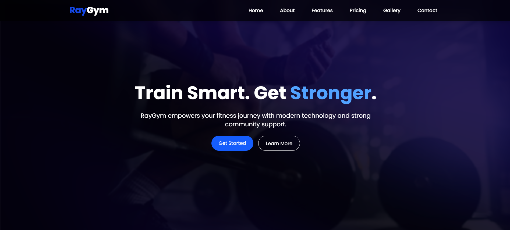
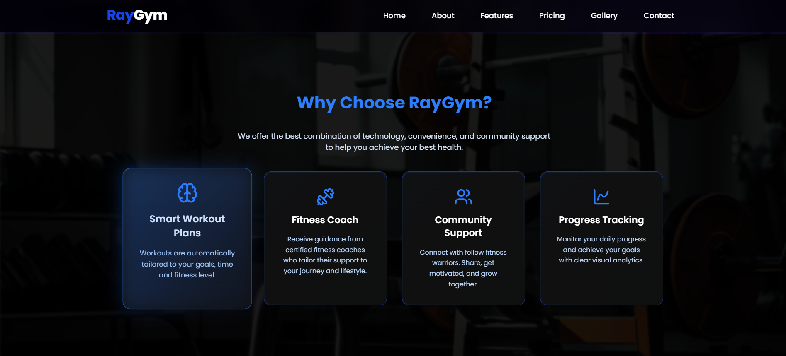

# 💪 RayGym — Smart Fitness Platform Landing Page

RayGym adalah landing page modern dan interaktif untuk layanan fitness digital. Website ini dirancang dengan visual kuat, fitur lengkap, dan pengalaman pengguna yang smooth — cocok untuk promosi gym, aplikasi kebugaran, atau komunitas kesehatan.

## 🔥 Fitur Utama

- 📱 **Navbar Fixed + Scroll Smooth**: Navigasi tetap di atas & scroll smooth ke setiap section.
- 💥 **Hero Section Dinamis**: Animasi typing motivasional (`Stronger`, `Fitter`, `Healthier`) + CTA langsung.
- 🧠 **About Section**: Penjelasan brand RayGym dengan kombinasi teks & gambar.
- ⚙️ **Features Section**: Empat fitur utama: Smart Workout Plans, Fitness Coach, Community Support, Progress Tracking.
- 💰 **Pricing Section**: Pilihan harga Harian, Bulanan, Tahunan dengan highlight interaktif.
- 🖼️ **Gallery Section**: Galeri grid gambar untuk memperkuat branding.
- 📣 **CTA Section**: Ajakan bergabung dengan tombol aksi.
- 🔗 **Footer Responsif**: Kontak, link navigasi cepat, social media, alamat.

## 🛠️ Teknologi

- **React.js**
- **Tailwind CSS**
- **Lucide React Icons**
- **Custom Typing Effect (React Hooks)**
- **Responsive Layout (Mobile First)**
- **Smooth Scrolling Navigation**

## 🚀 Cara Menjalankan

```bash
git clone https://github.com/raiakmal/ray-gym.git
cd raygym
npm install
npm run dev
```

> Pastikan Node.js versi terbaru sudah terpasang dan gunakan bundler seperti Vite.

## 🧪 Fitur Interaktif

- Navigasi antar section menggunakan scroll smooth berbasis event, bukan anchor default.
- Layout responsif untuk semua resolusi (mobile hingga desktop).
- Animasi & efek transisi pada tombol dan hover.

## 🤖 AI Support Explanation

Landing page ini didesain dan dikembangkan dengan bantuan AI (GitHub Copilot, ChatGPT, dan IBM Granite) untuk:

- Otomatisasi pembuatan efek animasi dan interaksi.
- Memastikan kode tetap clean, konsisten, dan mudah dikembangkan.

## 📌 Catatan

- Gambar latar & galeri menggunakan file lokal di folder `/public`. Pastikan file tersedia.

## 🖼️ Preview




## 📧 Kontak

- **Email:** [muhammadrai0504@gmail.com](mailto:muhammadrai0504@gmail.com)
- **Lokasi:** Tasikmalaya, Indonesia

---

©️ 2025 RayGym — Built with 💙
